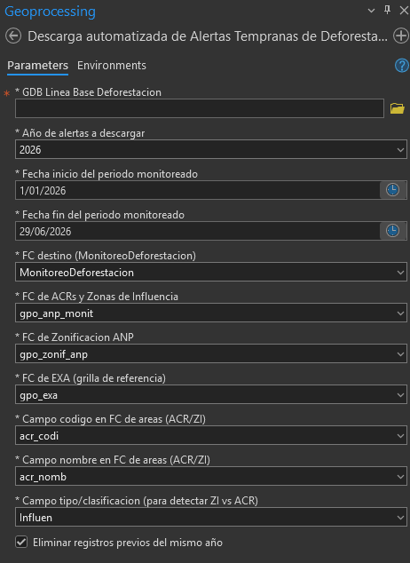
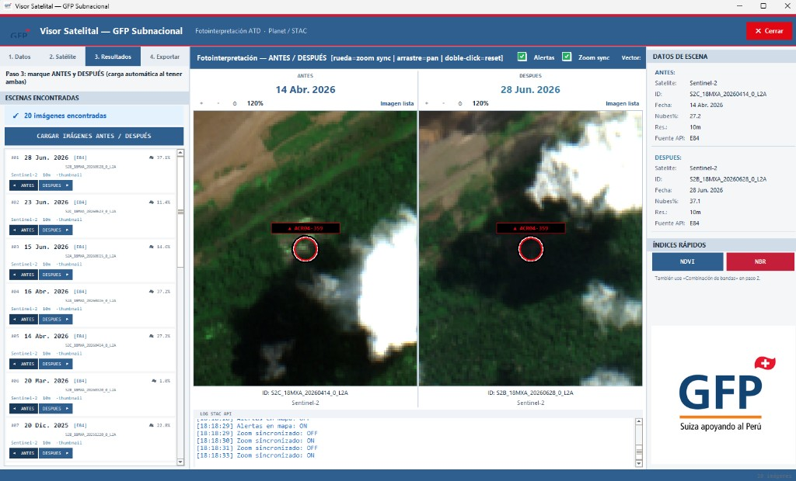
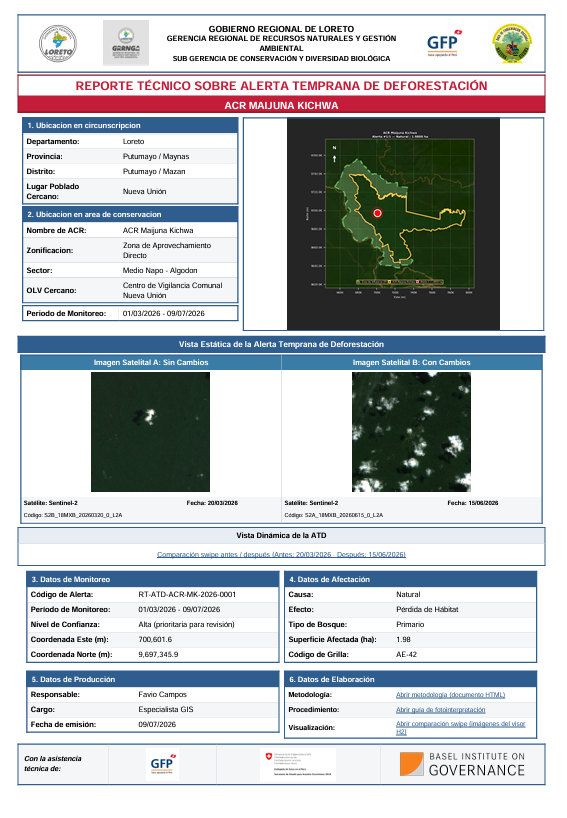
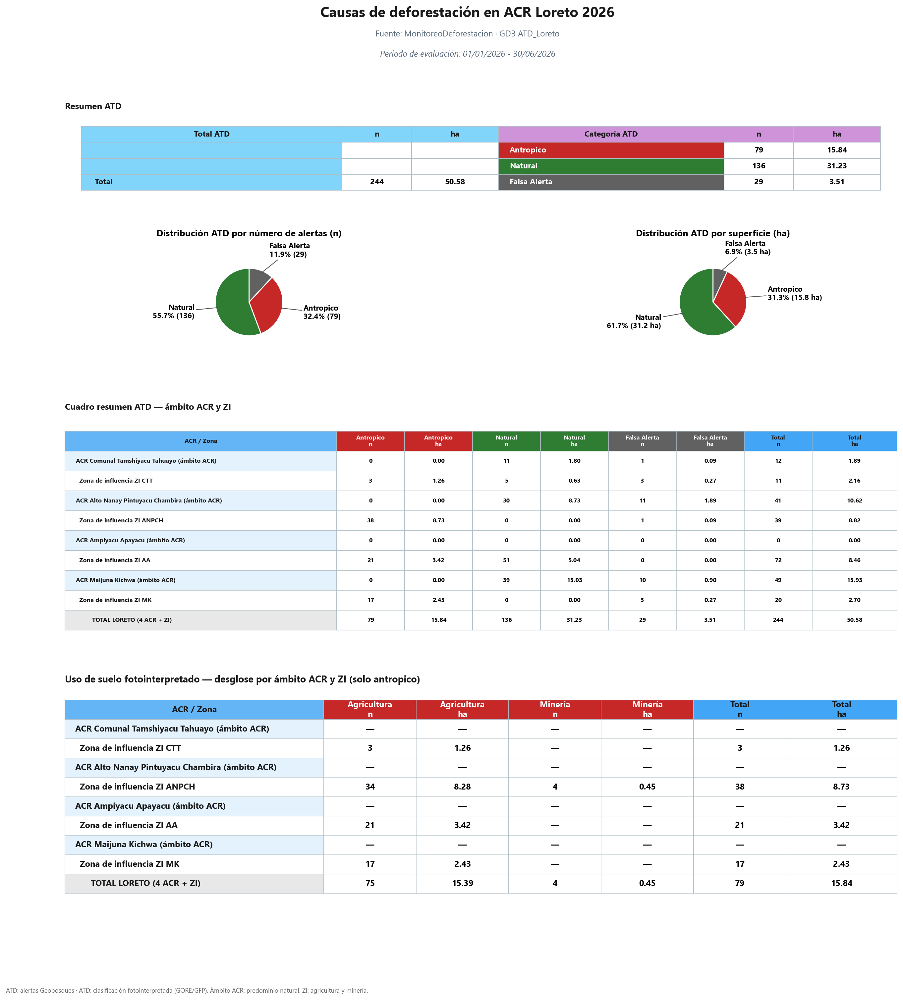
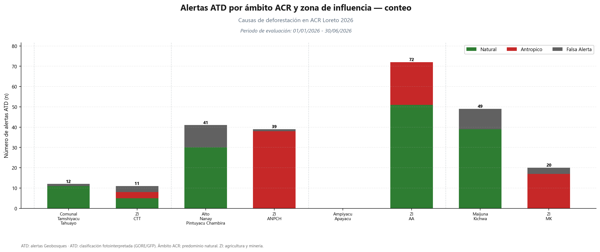

<p align="center">
  
  &nbsp;&nbsp;&nbsp;&nbsp;
  
  &nbsp;&nbsp;&nbsp;&nbsp;
  
</p>

<h1 align="center">Sistema de Alertas Tempranas de Deforestación<br/>para Áreas de Conservación Regional</h1>

<p align="center">
  <strong>Aplicación en San Martín, Loreto y Cusco</strong><br/>
  <em>GFP Subnacional · Suiza apoyando al Perú</em>
</p>

<p align="center">
  <a href="https://favio138-hub.github.io/SATD-ACR-Peru/docs/GUIA_VISUAL.html"><strong>Abrir guía visual completa (con capturas H1 · H2 · H3)</strong></a><br/>
  <a href="https://favio138-hub.github.io/SATD-ACR-Peru/INDICE.html">Índice del sistema</a><br/>
  <sub>Si el enlace aún no carga: <a href="https://html-preview.github.io/?url=https://raw.githubusercontent.com/Favio138-hub/SATD-ACR-Peru/main/docs/GUIA_VISUAL.html">vista previa HTML</a> · o abra <code>INDICE.html</code> en su PC</sub>
</p>

<p align="center">
  <a href="#para-quién-es">Para quién es</a> ·
  <a href="#cómo-trabajar-en-3-pasos">Cómo trabajar</a> ·
  <a href="#las-tres-regiones">Las 3 regiones</a> ·
  <a href="#por-qué-pesa-tanto">¿Por qué pesa?</a> ·
  <a href="#qué-incluye-cada-paquete">Qué incluye</a>
</p>

---

## Para quién es

Este sistema es para el **personal de las ACR** y equipos de monitoreo regional.  
No necesita ser programador: solo **ArcGIS Pro** y seguir la guía de su región.

En las **tres regiones** el trabajo es el mismo:

1. Bajar alertas  
2. Revisarlas con satélite  
3. Generar el **informe PDF oficial**

---

## Cómo trabajar (en 3 pasos)

| Paso | Herramienta | Qué hace usted |
|:----:|-------------|----------------|
| **1** | **H1 — Geobosques** | Descarga alertas del periodo a la base de datos |
| **2** | **H2 — Visor satelital** | Compara ANTES / DESPUÉS y clasifica la alerta |
| **3** | **H3 — Reporte PDF** | Genera el informe técnico institucional |

```text
  Alertas Geobosques  →  Fotointerpretación  →  Informe PDF
         (H1)                   (H2)                (H3)
```

### Guía visual (recomendado)

Abra la **[guía visual completa](docs/GUIA_VISUAL.html)**: muestra capturas reales de H1, del visor H2 y del PDF final H3, con el mismo flujo para San Martín, Loreto y Cusco.

<p align="center">
  
</p>
<p align="center"><em>H1 — Descarga de alertas en ArcGIS Pro</em></p>

<p align="center">
  
</p>
<p align="center"><em>H2 — Visor satelital ANTES / DESPUÉS</em></p>

<p align="center">
  
</p>
<p align="center"><em>H3 — Reporte PDF institucional (resultado final)</em></p>

### Primera vez

1. Descargue el repositorio (**Code → Download ZIP**) o clónelo.  
2. Abra [`INDICE.html`](INDICE.html) y elija **su región**.  
3. En ArcGIS Pro abra **solo la carpeta de esa región**.  
4. **Catálogo → Toolboxes → Add Toolbox** → agregue H1, H2 y H3.  
5. Ejecute `DIAGNOSTICO_ENTORNO.bat`.  
6. Siga la [guía visual](docs/GUIA_VISUAL.html) o la guía HTML de su región.

> **Importante:** no mueva solo `toolbox/`. Trabaje siempre con la carpeta completa de la región.

---

## Las tres regiones

| Región | ACR | Carpeta | Guía | PDF ejemplo |
|--------|-----|---------|------|-------------|
| **Loreto** | Ampiyacu, Tamshiyacu Tahuayo, Maijuna Kichwa, Alto Nanay | [`regiones/ATD_Loreto/`](regiones/ATD_Loreto/) | [Guía](regiones/ATD_Loreto/guia/GUIA_ATD_LORETO.html) | [PDF](regiones/ATD_Loreto/docs/EJEMPLO_reporte_ATD_Loreto.pdf) |
| **San Martín** | Cordillera Escalera (CE), BOSHUMI | [`regiones/ATD_San_Martin/`](regiones/ATD_San_Martin/) | [Guía](regiones/ATD_San_Martin/guia/GUIA_ATD_SAN_MARTIN.html) | [PDF](regiones/ATD_San_Martin/docs/EJEMPLO_reporte_ATD_San_Martin.pdf) |
| **Cusco** | Choquequirao, Chuyapi Urusayhua, Q'eros Kosnipata | [`regiones/ATD_Cuzco/`](regiones/ATD_Cuzco/) | [Guía](regiones/ATD_Cuzco/guia/GUIA_ATD_CUZCO.html) | [PDF](regiones/ATD_Cuzco/docs/EJEMPLO_reporte_ATD_Cuzco.pdf) |

Las tres tienen **toolbox H1–H2–H3**, GDB, logos, guía y PDF de ejemplo. Loreto es el paquete de referencia (más documentado), pero **el flujo es el mismo en las tres**.

### Documentación visual Loreto 2026 (referencia nacional)

<p align="center">
  
</p>
<p align="center">
  
</p>

---

## ¿Por qué pesaba tanto? (y cómo se bajó)

**Pregunta frecuente:** el repo solo Loreto pesaba ~25–35 MB; ¿por qué el de 3 regiones llegaba a ~3 GB?

### Cómo se “aligeró” Loreto
Loreto **ya era liviano**: su GDB de línea base ronda **~30 MB**. En el paquete de taller además se deja `MonitoreoDeforestacion` vacío (las alertas se bajan con H1). No había una GDB de cartografía regional de medio gigabyte.

### De dónde salía el peso de las 3 regiones
| Qué | Antes | Ahora (mínimo real) |
|-----|------:|--------------------:|
| GDB Loreto | ~36 MB | **~29 MB** |
| GDB San Martín (monitoreo) | ~41 MB | **~14 MB** |
| GDB San Martín ZEE (cartografía) | **~494 MB** | **~9 MB** (solo centros poblados que usa el PDF) |
| GDB Cusco | **~316 MB** | **~26 MB** (grilla recortada a ACR; capas no usadas eliminadas) |
| **Total GDB 3 regiones** | **~887 MB** | **~77 MB** |

### Qué NO se sube a GitHub (resultados de trabajo)
- `pdfs/` generados por usted  
- `imagenes_sentinel/` del visor  
- `mapas/` y `documentacion_atd/` temporales  

Esos archivos pueden hacer que la carpeta local se vea de **varios GB**, pero **no forman parte del producto** en el repositorio.

### Peso real del producto (estructura limpia)
Con GDB aligeradas + sin resultados de trabajo, el contenido útil ronda **toolbox + logos + guías + GDB (~77 MB) + PDF de ejemplo (~90 MB)** ≈ **~200–250 MB** en disco limpio (más logos/docs). El resto era cartografía/grillas sobrantes o salidas de corridas.


---

## Qué incluye cada paquete

| Carpeta | ¿En GitHub? | Contenido |
|---------|:-----------:|-----------|
| `toolbox/` | Sí | H1, H2, H3 |
| `GDB/` | Sí | Datos base de la región |
| `logos/` | Sí | Logos del informe |
| `guia/` · `docs/` | Sí | Guías + 1 PDF de ejemplo |
| `pdfs/` | **No** | Reportes que usted genere |
| `imagenes_sentinel/` | **No** | Exportaciones del visor |
| `mapas/` · `documentacion_atd/` | **No** | Salidas temporales |

### Estado verificado

| Componente | Loreto | San Martín | Cusco |
|------------|:------:|:----------:|:-----:|
| Toolbox H1 · H2 · H3 | Sí | Sí | Sí |
| Geodatabases | 2 | 2 | 1 |
| Logos | Sí | Sí | Sí |
| Guía HTML | Sí | Sí | Sí |
| PDF de ejemplo | Sí | Sí | Sí |

**Sí: el producto está armado de punta a punta** (herramientas + datos + logos + guías) para las tres regiones.

---

## Requisitos

- ArcGIS Pro 3.x  
- Internet para H1 (Geobosques) y para imágenes en H2  
- *(Opcional)* clave Planet para el visor  

Si algo falla: ejecute `DIAGNOSTICO_ENTORNO.bat` en la carpeta de su región.

---

## Otros repositorios

| Repositorio | Uso |
|-------------|-----|
| **Este** — [SATD-ACR-Peru](https://github.com/Favio138-hub/SATD-ACR-Peru) | Producto final **3 regiones** |
| [ATD-Loreto-GFP](https://github.com/Favio138-hub/ATD-Loreto-GFP) | Solo Loreto (~25–35 MB) |

---

## Créditos

**GFP Subnacional** · GORE Loreto, San Martín y Cusco · SECO / Basel Institute on Governance

<sub>Versión 2026 · Uso institucional ATD ACR</sub>
