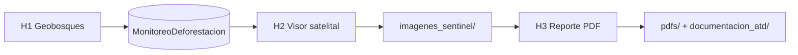

<p align="center">
  
  &nbsp;&nbsp;&nbsp;&nbsp;
  
  &nbsp;&nbsp;&nbsp;&nbsp;
  
</p>

<h1 align="center">ATD Toolbox — Loreto</h1>

<p align="center">
  <strong>Alertas Tempranas de Deforestación</strong> en Áreas de Conservación Regional<br/>
  <em>GFP Subnacional · Suiza apoyando al Perú</em>
</p>

<p align="center">
  <a href="#demo-5-minutos">Demo 5 minutos</a> ·
  <a href="#demo-taller-completo">Taller completo</a> ·
  <a href="#inicio-rápido">Inicio rápido</a> ·
  <a href="guia/GUIA_ATD_LORETO.html">Guía completa</a> ·
  <a href="docs/EJEMPLO_reporte_ATD_Loreto.pdf">PDF de ejemplo</a>
</p>

---

## ¿Qué es este repositorio?

Paquete **autocontenido y listo para ArcGIS Pro** que implementa el flujo institucional de **Alertas Tempranas de Deforestación (ATD)** en las ACR de Loreto. No requiere instalar nada fuera de la carpeta del repositorio: trae geodatabases, toolbox, logos y documentación.

| Herramienta | Nombre | Qué hace |
|:-----------:|--------|----------|
| **H1** | Descarga Geobosques | Descarga alertas del año y las inserta en `MonitoreoDeforestacion` |
| **H2** | Visor satelital | Fotointerpretación antes/después con Planet, Sentinel-2 y Landsat |
| **H3** | Reporte PDF | Diagnóstico pre-vuelo + informe oficial (mapa, imágenes con vector rojo, metadatos) |

**¿Para quién es?** Equipos de monitoreo de ACR, personal de la GRRNGA Loreto y facilitadores GFP que imparten talleres de fotointerpretación y reporte ATD.

### ACR incluidas

| Código | Área de Conservación Regional |
|--------|------------------------------|
| ACR09 | Ampiyacu Apayacu |
| ACR04 | Comunal Tamshiyacu Tahuayo |
| ACR17 | Maijuna Kichwa |
| ACR10 | Alto Nanay Pintuyacu Chambira |

---

## Demo 5 minutos

Prueba rápida **sin conexión a Geobosques** — ideal para ver el visor y el PDF con datos ya cargados en la GDB.

| Paso | Acción | Qué deberías ver |
|:----:|--------|------------------|
| 1 | Clonar o descargar este repo y abrir ArcGIS Pro | Carpeta `ATD_Loreto/` intacta |
| 2 | **Catalog → Add Toolbox** → los tres `.pyt` en `toolbox/` | H1, H2 y H3 en el panel de geoprocesamiento |
| 3 | Agregar al mapa `GDB/Linea_base_deforestación_Loreto.gdb` → `MonitoreoDeforestacion` | Alertas 2026 en el mapa |
| 4 | **H2** → misma GDB → `MonitoreoDeforestacion` → seleccionar **1 polígono** en el mapa | Se abre el visor satelital GFP (antes/después) |
| 5 | En H2: buscar escenas → marcar ANTES y DESPUÉS → exportar (opcional) | Imágenes en `imagenes_sentinel/` |
| 6 | **H3** → Diagnóstico Pre-Vuelo → Generar Reporte ATD (1 alerta) | PDF en `pdfs/` |
| 7 | Comparar con [`docs/EJEMPLO_reporte_ATD_Loreto.pdf`](docs/EJEMPLO_reporte_ATD_Loreto.pdf) | Mismo formato institucional (mapa, S2, swipe, logos) |



> En el demo corto puedes saltar **H1** si la capa `MonitoreoDeforestacion` ya tiene alertas. Para el histórico 2001–2025 usa `MonitoreoDeforestacionAcumulado`.

---

## Demo taller completo

Flujo real de campo y capacitación (≈ 30–45 min por alerta):

1. **H1 — Descarga Geobosques**  
   Conecta a la plataforma Geobosques, descarga alertas del periodo vigente e inserta en `MonitoreoDeforestacion`. Verifica en la tabla de atributos: `anp_codi`, `md_exa`, `zona_influencia`, superficie.

2. **H2 — Fotointerpretación**  
   - Selecciona la alerta en el mapa (no solo en la tabla).  
   - Paso 2: elige satélite (Sentinel-2 recomendado) y rango de fechas.  
   - Paso 3: asigna escena **ANTES** y **DESPUÉS**.  
   - Completa causa de deforestación y confianza en la tabla.  
   - Paso 4: exporta imágenes HD al mapa y a `imagenes_sentinel/` (alimentan el PDF).

3. **H3 — Reporte oficial**  
   - Ejecuta **Diagnóstico Pre-Vuelo** (valida logos, GDB, Python).  
   - **Generar Reporte ATD** con la misma alerta.  
   - El PDF incluye mapa de contexto, imágenes satelitales con **polígono rojo** de la alerta, vista dinámica swipe y pie de página institucional.

4. **Entregables**  
   - `pdfs/RT-ATD-ACR-…pdf`  
   - `documentacion_atd/` (HTML swipe y metodología)

---

## Inicio rápido

### Requisitos

- **ArcGIS Pro 3.x**
- Python `arcgispro-py3` con: `geopandas` `fiona` `pandas` `numpy` `matplotlib` `Pillow` `pyproj` `reportlab` `requests`
- *(Opcional)* `PLANET_API_KEY` para imágenes Planet en H2

```bat
pip install geopandas fiona pandas numpy matplotlib Pillow pyproj reportlab requests
```

### Pasos

1. **Clone** este repositorio (o descargue ZIP).
2. Trabaje siempre desde la raíz **`ATD_Loreto/`** — no mueva solo el toolbox.
3. **Catalog → Toolboxes → Add Toolbox** → agregue H1, H2 y H3 en `toolbox/`.
4. Ejecute **`DIAGNOSTICO_ENTORNO.bat`** la primera vez.
5. Lea [`guia/GUIA_ATD_LORETO.html`](guia/GUIA_ATD_LORETO.html).
6. Siga el [demo 5 minutos](#demo-5-minutos) o el [taller completo](#demo-taller-completo).

### Parámetros GDB (referencia)

| Parámetro | Valor |
|-----------|-------|
| GDB línea base | `GDB/Linea_base_deforestación_Loreto.gdb` |
| Alertas vigentes (2026) | `MonitoreoDeforestacion` |
| Histórico 2001–2025 | `MonitoreoDeforestacionAcumulado` |
| Gestión ACR (OLV, lugar poblado) | `GDB/GestionACR_16012024.gdb` |

---

## Estructura del paquete

```
ATD_Loreto/
├── README.md              ← Está leyendo esto
├── toolbox/               H1 · H2 · H3 + módulos Python
├── GDB/                   Línea base + gestión ACR
├── logos/                 Identidad visual (GFP, GORE, GRRNGA, ACR…)
├── guia/                  Guía HTML + solución de problemas
├── docs/                  PDF de ejemplo para demo
├── pdfs/                  Sus reportes generados (no se suben a git)
├── imagenes_sentinel/     Exportaciones del visor H2
├── mapas/                 Mapas de contexto
├── documentacion_atd/     HTML swipe y metodología
└── DIAGNOSTICO_ENTORNO.bat
```

---

## Características destacadas

- Visor satelital GFP con Planet + STAC (Sentinel-2, Landsat) y exportación HD al mapa
- Imágenes del PDF con **polígono rojo** de la alerta superpuesto
- Campos y dominios ATD normalizados (`zona_influencia`, `md_exa`, `anp_codi`, WGS84)
- Logos institucionales en visor y PDF (GFP, SECO, Basel, GORE, GRRNGA, ACR)
- Modo estable en H3 si ArcGIS Pro se cierra → `guia/ATD_SI_SE_CIERRA_PRO.md`

---

## Soporte y créditos

| Recurso | Ubicación |
|---------|-----------|
| Guía Loreto | `guia/GUIA_ATD_LORETO.html` |
| ArcGIS Pro se cierra | `guia/ATD_SI_SE_CIERRA_PRO.md` |
| Diagnóstico Python | `DIAGNOSTICO_ENTORNO.bat` |
| Reporte demo | `docs/EJEMPLO_reporte_ATD_Loreto.pdf` |
| Publicar en GitHub | `GITHUB_DESKTOP.md` |

**GFP Subnacional** · Cooperación Suiza (SECO) · Basel Institute on Governance  
**Gobierno Regional de Loreto** · Gerencia Regional de Recursos Naturales y Gestión Ambiental

<p align="center">
  <sub>Versión 2026 · Uso institucional del equipo ATD Loreto</sub>
</p>
